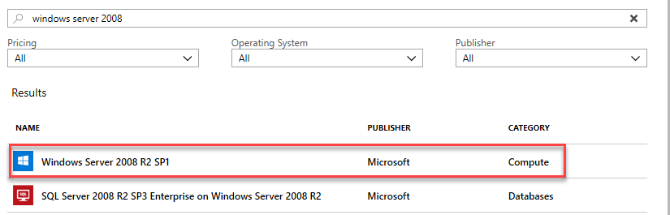
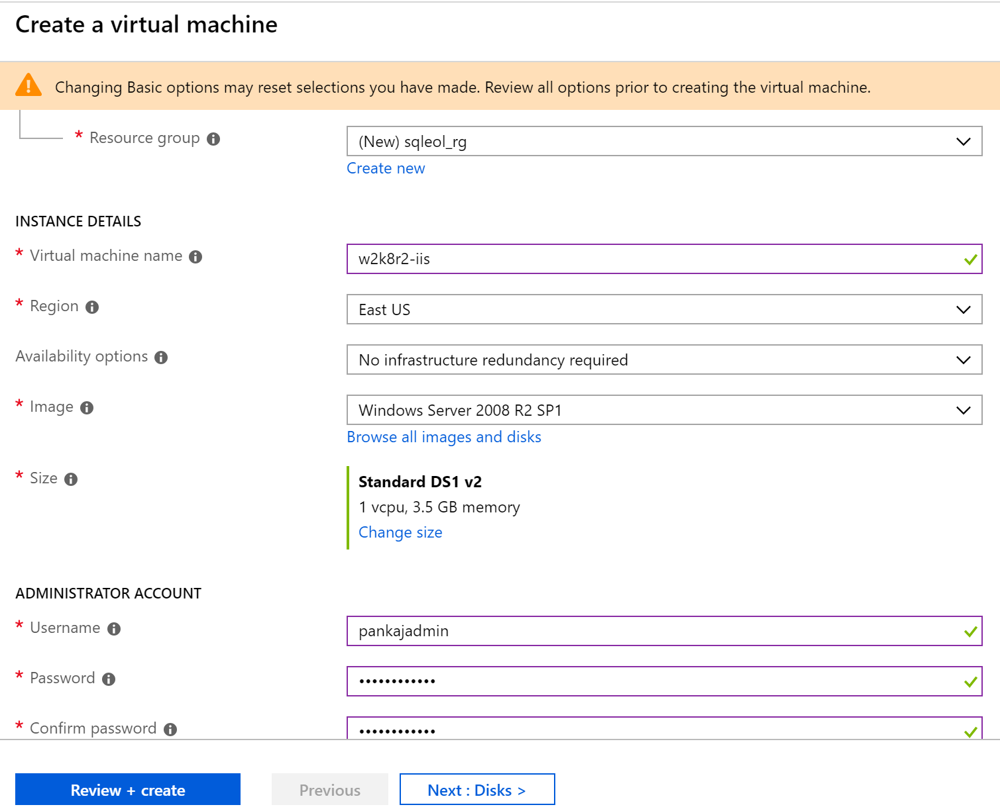
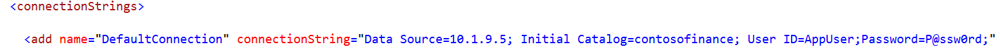
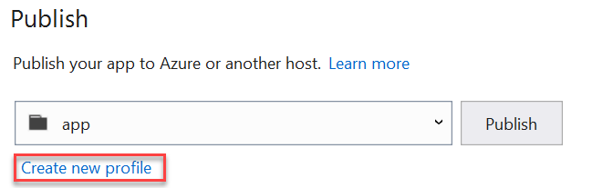
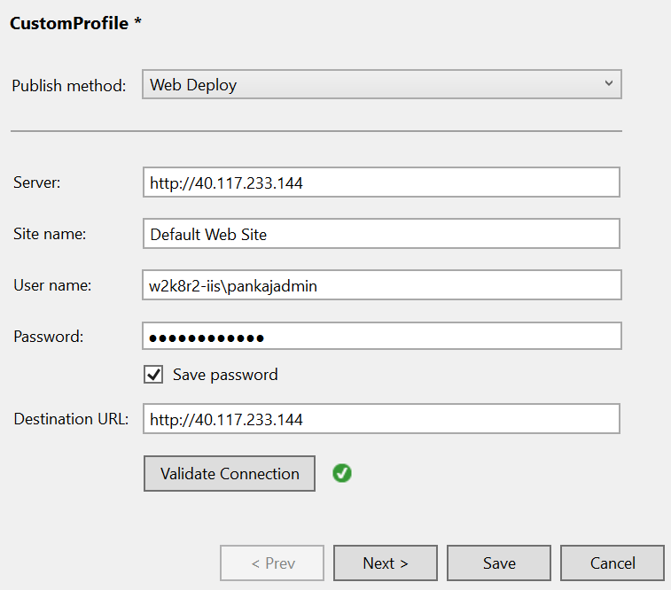
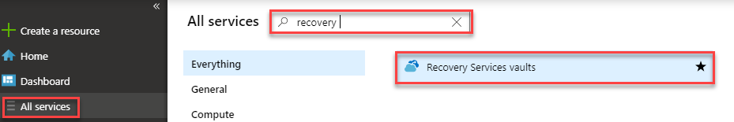
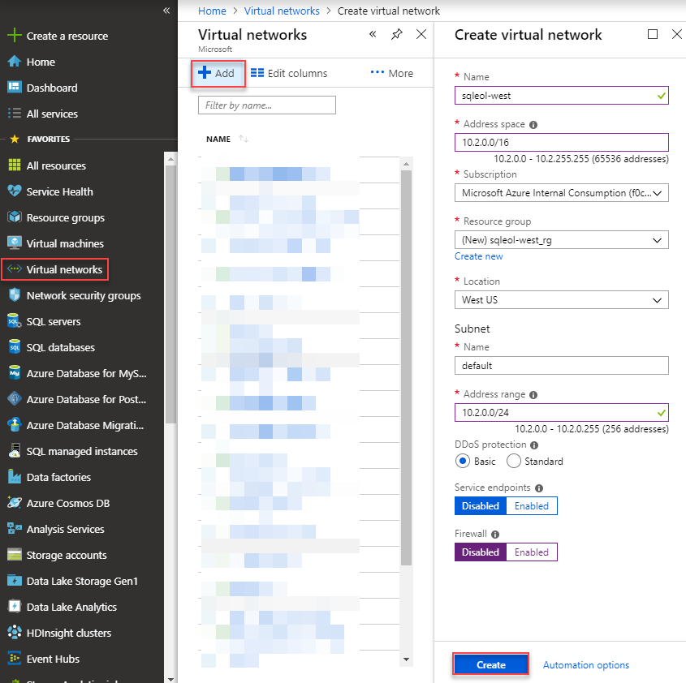

Windows Server and SQL Server 2008 R2 end of support planning

Before the hands-on lab setup guide

March 2019

Information in this document, including URL and other Internet Web site references, is subject to change without notice. Unless otherwise noted, the example companies, organizations, products, domain names, e-mail addresses, logos, people, places, and events depicted herein are fictitious, and no association with any real company, organization, product, domain name, e-mail address, logo, person, place or event is intended or should be inferred. Complying with all applicable copyright laws is the responsibility of the user. Without limiting the rights under copyright, no part of this document may be reproduced, stored in or introduced into a retrieval system, or transmitted in any form or by any means (electronic, mechanical, photocopying, recording, or otherwise), or for any purpose, without the express written permission of Microsoft Corporation.

Microsoft may have patents, patent applications, trademarks, copyrights, or other intellectual property rights covering subject matter in this document. Except as expressly provided in any written license agreement from Microsoft, the furnishing of this document does not give you any license to these patents, trademarks, copyrights, or other intellectual property.

The names of manufacturers, products, or URLs are provided for informational purposes only and Microsoft makes no representations and warranties, either expressed, implied, or statutory, regarding these manufacturers or the use of the products with any Microsoft technologies. The inclusion of a manufacturer or product does not imply endorsement of Microsoft of the manufacturer or product. Links may be provided to third party sites. Such sites are not under the control of Microsoft and Microsoft is not responsible for the contents of any linked site or any link contained in a linked site, or any changes or updates to such sites. Microsoft is not responsible for webcasting or any other form of transmission received from any linked site. Microsoft is providing these links to you only as a convenience, and the inclusion of any link does not imply endorsement of Microsoft of the site or the products contained therein.

© 2018 Microsoft Corporation. All rights reserved.

Microsoft and the trademarks listed at <https://www.microsoft.com/en-us/legal/intellectualproperty/Trademarks/Usage/General.aspx> are trademarks of the Microsoft group of companies. All other trademarks are property of their respective owners.

**Contents**

<!-- TOC -->

- [Windows Server and SQL Server 2008 R2 end of support planning before the hands-on lab setup guide](#Windows-Server-and-SQL-Server-2008-R2-end-of-support-planning-before-the-hands-on-lab-setup-guide)
    - [Requirements](#requirements)
    - [Before the hands-on lab](#before-the-hands-on-lab)
        - [Task 1: Create the IIS Windows 2008 R2 VM](#Task-1:-Create-the-IIS-Windows-2008-R2-VM)
        - [Task 2: Create SQL VM](#Task-2:-Create-SQL-VM)
        - [Task 3: Install IIS](#Task-3:-Install-IIS)
        - [Task 4: Setup the SQL Server VM and restore the database](#Task-4:-Setup-the-SQL-Server-VM-and-restore-the-database)
        - [Task 5: Deploy the ContosoFinance Web Application](Task-5:-Deploy-the-ContosoFinance-Web-Application)
        - [Task 6: Configure Azure Site Recovery](#task-6-Configure-Azure-Site-Recovery)
        - [Task 7: Create a Network to recover IIS and SQL VMs to](#Task-7:-Create-a-Network-to-recover-IIS and-SQL-VMs-to)

<!-- /TOC -->

# Windows Server and SQL Server 2008 R2 end of support planning before the hands-on lab setup guide 
## Requirements

1.  Microsoft Azure subscription
2.  Visual Studio 2017 Community Edition or higher

## Before the hands-on lab

Duration: 90 minutes

In this exercise, you will deploy the source environment for this lab. The source environment is designed to represent the existing on-premises environment you will migrate to Azure. As we will not have access to your real on-premises environment, we will be setting up the "on-premises" environment in another Azure Region.

### Task 1: Create the IIS Windows 2008 R2 VM

1. Browse to the Azure Portal at <https://portal.azure.com> and verify that you are logged in with the subscription that you wish to use for this lab.

2. Click the button to create a Windows Server 2008 R2 Machine

3. In the search bar, search for Windows Server 2008 and select **Windows Server 2008 R2 SP1** and select Create

4. On the **Basics** page fill in the details according to your environment

   1.  Select the right subscription
   2.  Create a new resource group named sqleol_rg (or reuse an existing)
   3.  Give the VM a name, ex: w2k8r2-iis
   4.  Pay attention to the Region selected, you can choose another region close to you or leave as the default
   5.  Leave Availability options to the default
   6.  You do not need a large VM, the default DS1v2 should suffice
   7.  Set Username and Password for the administrator account
   8.  Under Inbound Port Rules select **allow selected ports** and choose **HTTP (80)** and **RDP (3389) ** from the drop down list
   9.  click **Next: Disks**

   6. On the **Disks** page change the OS Disk type to Standard HDD and click **Next: Networking**
   7. On the **Networking** page, the default will be to create a new virtual network, leave the default or choose an existing network. Leave defaults for other options and click **Review + Create**
   8. On the **Review + Create** page select **Create**.

### Task 2: Create SQL VM

1. Repeat the same steps as above to create a SQL 2008 VM, with the following differences
   1. Choose the SQL Server 2008 R2 SP3 Enterprise on Windows Server 2008 R2 image
   2. Ensure you are creating the VM in the same resource group as the Windows Server from Task 1
   3. Change the size of the VM to a DS11_v2 
   4. Under Inbound port rules, only enable **RDP 3389**
   5. On the networking page, the virtual network should be the same as created in Task 1

### Task 3: Install IIS

1. Once the Windows VM is created (<10 mins). Navigate to **Virtual Machines**, select the newly created VM 

2. On the Overview page, notate the Public IP address and click **Connect**. On the **Connect to Virtual Machine** blade, select **Dowload RDP file** and click connect. Leverage the credentials you used to create the VM

3. After logging into the Virtual machine, open Server Manager

4. Navigate to **Roles** under server manager and select Add Roles

5. Hit **Next** on the **Before You Begin** page

6. Select **Web Server (IIS)** from the **Select Server Roles page** and click next.

7. Click **next** on the **Web Server (IIS)** page

8. Select ASP.NET under Application development on the **Select Role Services page** and add any required role services, click **next** and **Install** on the confirmation page

9. Download the WebPlatform installer from [here](https://www.microsoft.com/web/downloads/platform.aspx)

10. Once downloaded, launch the webplatform installer and install Web Deploy 3.6 for Hosting Servers

    

    11. Download and install .NET 4.6.1 from [here](https://www.microsoft.com/en-us/download/details.aspx?id=49981)

### Task 4: Setup the SQL Server VM and restore the database

1. Once the SQLVM is created (<10 mins). Navigate to **Virtual Machines**, select the newly created SQL VM
2. Navigate to the networking page and notate the Private IP address
3. Connect to the SQL VM by downloading the RDP File
4. Add a firewall rule to allow port 1433 within the Windows Firewall [Reference](https://dbatricksworld.com/how-to-open-firewall-ports-on-windows-server-2008-r2/)
5. Turn off IE Enhanced security [Reference](https://blogs.technet.microsoft.com/chenley/2011/03/10/how-to-turn-off-internet-explorer-enhanced-security-configuration/)
6. Download the ContosoFinance database [backup file from github](https://github.com/pansaty/MCW-Windows-Server-and-SQL-Server-2008-R2-End-of-Support-Planning/blob/master/Hands-on%20lab/lab-files/ContosoFinance.bak) under Hands-On Labs/lab-files
7. Launch SQL Server management studio locally
8. Enable SQL Authentication at the instance and restart the instance from within Management Studio [Reference](https://docs.microsoft.com/en-us/sql/database-engine/configure-windows/change-server-authentication-mode?view=sql-server-2017) 
9. Restore the downloaded ContosoFinance database
10. Create a new SQL Login called appuser and grant it dbo access to the restored ContosoFinance database. For simplicity (do not do in production) Uncheck **Enforce Password Policy**, **Enforce password expiration** and **User must change password at next login**

### Task 5: Deploy the ContosoFinance Web Application

1. Download the Web App from Hands-On Labs/lab-files/contoso-finance
2. Open in Visual Studio Community Edition
3. Open the web.config file and update the connection string parameters, using the private IP address of the SQL vm created in Task2 as the Data Source

4. In Solution Explorer, right click on ContosoFinance Project and select Publish

5. Create a new Publishing profile 

   1. On the Publish page click on the Create new profile link

   2. On the **Pick a publish target screen**, select **IIS, FTP, etc** and hit ok

   3. On the **CustomProfile screen**, select Web Deploy as the Publish method, leverage the Public IP address of the Windows 2008 VM created in Step 1 for Server and Destination URL, use **Default Web Site** as the site name, the admin account you used when you create the Windows 2008 VM in step 1 in the format of [Servername\UserName]. To ensure that connectivity and all the right components are installed, click **Validate Connection**. You should get a green checkmark as shown below. Click **Save**

      

   4. With the newly created CustomProfile select hit **Publish**

      

   5. After the app is published successfully the ContosoFinance webpage will appear

      

### Task 6: Configure Azure Site Recovery

1. Go back to the Azure Portal and under **All services** look for **Recovery Services vaults** and select it

2. Create a new Recovery services vault by clicking the **Add** button, give it a name and create a new resource group. **Choose a region different than the region where the Windows 2008 R2 IIS vm was created** and click **Create**

   

3. Within a few minutes the new Recovery Vault will be created, you may have to hit Refresh for it to become visible. Click on the newly created vault

4. To add protection of the Windows 2008 R2 IIS VM click on the **+ Replicate** button

   1. On the Source Blade

      1. Under Source, notice in the dropdown you can choose Azure or On-Premise, for the purpose of this exercise as we are simulating on-premise, we will keep the source as Azure. 

         **Note:**  In order to choose on-premises, there would be additional steps required see [Migrate on-premises machines to Azure](https://docs.microsoft.com/en-us/azure/site-recovery/migrate-tutorial-on-premises-azure)

      2. Under Source Location, choose the region where the Windows 2008 R2 IIS VM resides

      3. Under Source resource group, select the group you created in Task 1 

      4. hit OK

   2. On the Virtual Machines blade

      1. Select the Windows 2008 R2 IIS Machine only and hit OK

   3. On the settings page

      1. Review the setting and click **Create target resources**
      2. This will take several minutes to complete

   4. Once the above is done, click **Enable replication**. It will take about 10 mins to enable replication and setup the underlying components

   5. Once replication is setup, you can view the status under **Replicated Items** to view the status of synchronizing the VM. This may take up to an hour.

### Task 7: Create a Network to recover IIS and SQL VMs to

1. In the [Azure Portal](https://portal.azure.com) navigate to **Virtual Networks**. If Virtual Networks does not appear under the menu blade, search for it by clicking on **All services** and searching for Virtual Networks.

2. With the **Virtual networks** blade open, click on **+ Add**

   1. Provide a name

   2. Optionally change the address space

   3. Create a new resource group

   4. Under location select the same region where you were replicating the Windows Server 2008R2 IIS machine to

   5. Other options can remain as default, hit **Create**

      

You should follow all steps provided *before* performing the Hands-on lab.

