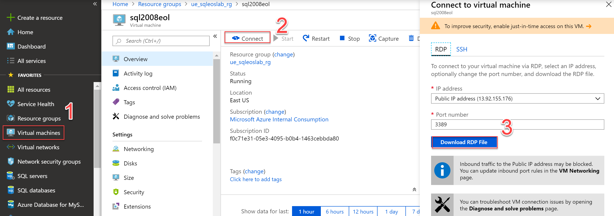

Windows Server and SQL Server 2008 R2 end of support planning

Before the hands-on lab setup guide

March 2019

Information in this document, including URL and other Internet Web site references, is subject to change without notice. Unless otherwise noted, the example companies, organizations, products, domain names, e-mail addresses, logos, people, places, and events depicted herein are fictitious, and no association with any real company, organization, product, domain name, e-mail address, logo, person, place or event is intended or should be inferred. Complying with all applicable copyright laws is the responsibility of the user. Without limiting the rights under copyright, no part of this document may be reproduced, stored in or introduced into a retrieval system, or transmitted in any form or by any means (electronic, mechanical, photocopying, recording, or otherwise), or for any purpose, without the express written permission of Microsoft Corporation.

Microsoft may have patents, patent applications, trademarks, copyrights, or other intellectual property rights covering subject matter in this document. Except as expressly provided in any written license agreement from Microsoft, the furnishing of this document does not give you any license to these patents, trademarks, copyrights, or other intellectual property.

The names of manufacturers, products, or URLs are provided for informational purposes only and Microsoft makes no representations and warranties, either expressed, implied, or statutory, regarding these manufacturers or the use of the products with any Microsoft technologies. The inclusion of a manufacturer or product does not imply endorsement of Microsoft of the manufacturer or product. Links may be provided to third party sites. Such sites are not under the control of Microsoft and Microsoft is not responsible for the contents of any linked site or any link contained in a linked site, or any changes or updates to such sites. Microsoft is not responsible for webcasting or any other form of transmission received from any linked site. Microsoft is providing these links to you only as a convenience, and the inclusion of any link does not imply endorsement of Microsoft of the site or the products contained therein.

© 2018 Microsoft Corporation. All rights reserved.

Microsoft and the trademarks listed at <https://www.microsoft.com/en-us/legal/intellectualproperty/Trademarks/Usage/General.aspx> are trademarks of the Microsoft group of companies. All other trademarks are property of their respective owners.

**Contents**

<!-- TOC -->

- [Windows Server and SQL Server 2008 R2 end of support planning before the hands-on lab setup guide](#Windows-Server-and-SQL-Server-2008-R2-end-of-support-planning-before-the-hands-on-lab-setup-guide)
    - [Requirements](#requirements)
    - [Before the hands-on lab](#before-the-hands-on-lab)
        - [Task 1: Create a SQL 2008R2 VM in Azure ](#Task-1:-Create-a-SQL-2008R2-VM in-Azure)
        - [Task 2: Setup the ContosoFinance Website](#Task-2:-Setup-the-ContosoFinance-Website)
        - [Task 3: Restore the ContosoFinance Backup file](#Task-3:-Restore-the-ContosoFinance-Backup-file)
        - [Task 4: Configure Connection string for the ContosoFinance site](#Task-4:-Configure-Connection-string-for-the-ContosoFinance-site)

<!-- /TOC -->

# Windows Server and SQL Server 2008 R2 end of support planning before the hands-on lab setup guide 
## Requirements

1.  Microsoft Azure subscription
2.  [Azure CLI](https://docs.microsoft.com/en-us/cli/azure/install-azure-cli?view=azure-cli-latest) 
3.  Download the [ContosoFinance.zip](https://github.com/pansaty/MCW-Windows-Server-and-SQL-Server-2008-R2-End-of-Support-Planning/blob/master/Hands-on-lab/lab-files/ContosoFinance.zip) deployment from Github
4.  [JSON deployment template](https://github.com/pansaty/MCW-Windows-Server-and-SQL-Server-2008-R2-End-of-Support-Planning/blob/master/Hands-on-lab/lab-files/sql2008r2VM.json) and [parameters file](https://github.com/pansaty/MCW-Windows-Server-and-SQL-Server-2008-R2-End-of-Support-Planning/blob/master/Hands-on-lab/lab-files/parameters.json) from Github

## Before the hands-on lab

Duration: 30 minutes

In order to focus on the options for moving SQL to Azure, this lab will be focused primarily on tools and options for migrating database to Azure. The lab assumes that you have already refactored your application for Azure WebApps. In a scenario where you may need to keep the application intact as it were on-prem, consider using Azure Site Recovery. 

### Task 1: Create a SQL 2008R2 VM in Azure 

1. With the [Azure CLI](https://docs.microsoft.com/en-us/cli/azure/install-azure-cli?view=azure-cli-latest) installed on your machine, open a PowerShell command prompt and run the following steps to Create a SQL 2008 R2 machine
   1. `az login` to login to your subscription. You will be prompted for credentials to authenticate to your account via web browser.
   2. `az group create --name ue_sqleoslab_rg --location "East US"`  to create a resource group for all items you will be creating for this lab
   3. `az group deployment create --resource-group ue_sqleoslab_rg --name SQL2008R2Deployment --template-file [PathToJSONTemplace]\sql2008r2VM.json  --parameters @[PathToParametersFile]\parameters.json` to deploy a SQL Server 2008R2 VM leveraging the [JSON deployment template](https://github.com/pansaty/MCW-Windows-Server-and-SQL-Server-2008-R2-End-of-Support-Planning/blob/master/Hands-on-lab/lab-files/sql2008r2VM.json) and [parameters file](https://github.com/pansaty/MCW-Windows-Server-and-SQL-Server-2008-R2-End-of-Support-Planning/blob/master/Hands-on-lab/lab-files/parameters.json) from Github
2. Leave the PowerShell command running and go to the next task. It should take < 10 mins to provision this VM

### Task 2: Setup the ContosoFinance Website

1. Open a new PowerShell command prompt, run the following to deploy the ContosoFinance website
   1. `az webapp create -g ue_sqleoslab_rg -p ContosoFinance -n ContosoFinance[initials]` to create an App Service plan for your web application, replacing the [place_holders] for your resource group and WebApp name. **Note:** Your WebApp name must be universally unique.
   2. `az webapp deployment source config-zip --resource-group [replace_with_your_resource_group] --name ContosoFinance[initials] --src [pathtozip]\ContosoFinance.zip` to deploy the ContosoFinance webapp
2. Close the PowerShell command prompt

### Task 3: Restore the ContosoFinance  SQL Server Backup file

This task is also representative of the effort needed to lift and shift a SQL Server 2008R2 instance from on-prem to Azure leveraging a backup/restore methodology. This can be enhanced using the [Microsoft® SQL Server® Backup to Microsoft Azure®Tool](https://www.microsoft.com/en-us/download/details.aspx?id=40740) to backup directly from On-Prem SQL Server to Azure blob storage, however this will require port 443 open from all source SQL Server instances. If this is not an option, you can backup to a central server and then leverage azcopy from a central server to copy backups to Azure blob storage. In addition if you were looking to do a minimal downtime migration for lift and shift where the target in Azure needs to be a SQL Server 2008 R2 instance, you could explore leveraging log shipping.

1. Login to the [Azure Portal](https://portal.azure.com)

2. Navigate to Virtual Machines and download the RDP file for the SQL 2008 R2 VM created in Task 1 and login to it using the credentials from the parameters.json file. If the parameters file is unchanged, use username: **sql2008admin** and password: **P@ssw0rd1234**

   

3. Download the [ContosoFinance.bak](https://github.com/pansaty/MCW-Windows-Server-and-SQL-Server-2008-R2-End-of-Support-Planning/blob/master/Hands-on-lab/lab-files/ContosoFinance.bak) file from GitHub and restore it to the newly created SQL 2008R2 VM. **Note:** In a real migration scenario from on-prem, you could stage the backup file in an Azure blob storage account. 

4. Launch SSMS and run the following to create a login for the application

   `create login AppUser`

   `create user from login AppUser`

   `Grant AppRole to AppUser`

### Task 4: Configure Connection string for the ContosoFinance site

1. Within the [Azure Portal](https://portal.azure.com) navigate to Azure Websites
2. Open application Settings
3. Update the connection string leveraging the SQL Server 2008 R2 instance created in Task1 and login credentials created in in Task 2
4. Go to the Overview page of the the Azure **** and launch ****. If all the configuration steps were completed successfully the ContosoFinance website will launch successfully

You should follow all steps provided *before* performing the Hands-on lab.

