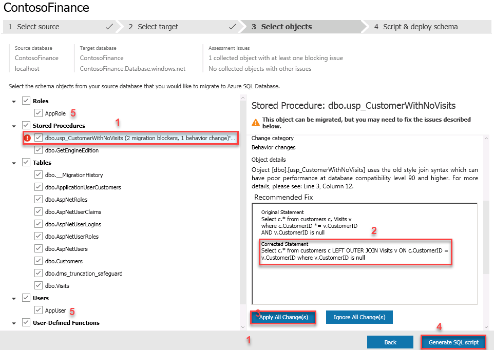
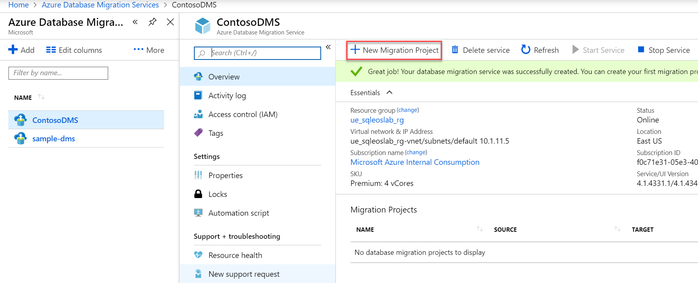
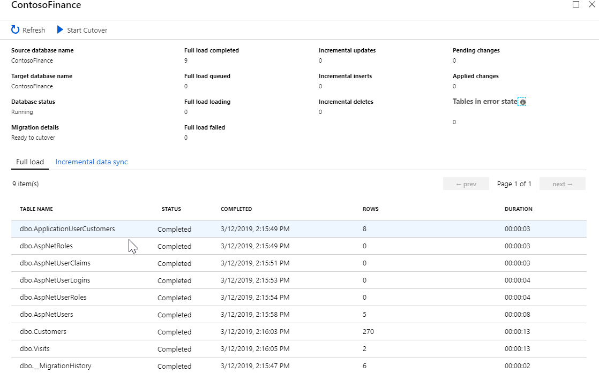
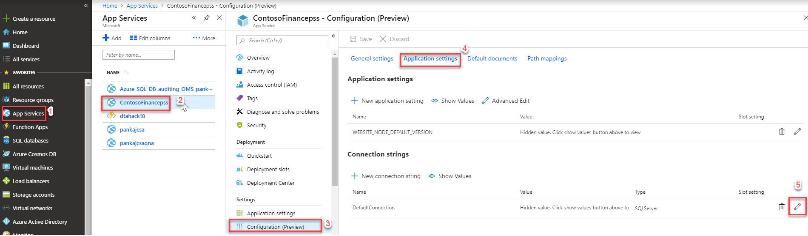
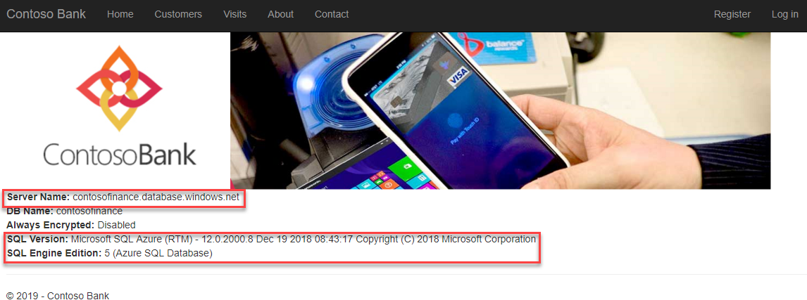
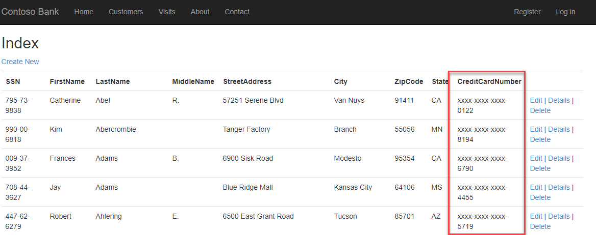
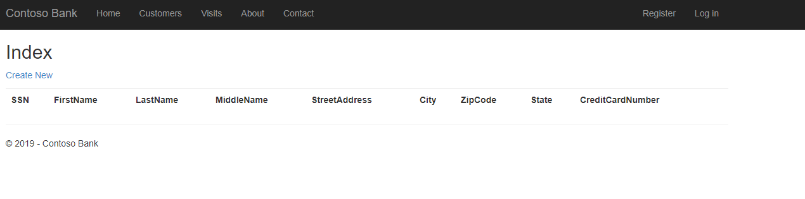
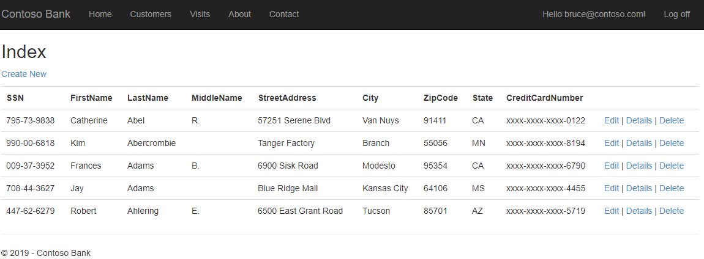

<div class="MCWHeader1">
Windows-Server-and-SQL-Server-2008-R2-End-of-Support-Planning
</div>


<div class="MCWHeader2">
Hands-on lab step-by-step
</div>
<div class="MCWHeader3">
March 2019
</div>


Information in this document, including URL and other Internet Web site references, is subject to change without notice. Unless otherwise noted, the example companies, organizations, products, domain names, e-mail addresses, logos, people, places, and events depicted herein are fictitious, and no association with any real company, organization, product, domain name, e-mail address, logo, person, place or event is intended or should be inferred. Complying with all applicable copyright laws is the responsibility of the user. Without limiting the rights under copyright, no part of this document may be reproduced, stored in or introduced into a retrieval system, or transmitted in any form or by any means (electronic, mechanical, photocopying, recording, or otherwise), or for any purpose, without the express written permission of Microsoft Corporation.

Microsoft may have patents, patent applications, trademarks, copyrights, or other intellectual property rights covering subject matter in this document. Except as expressly provided in any written license agreement from Microsoft, the furnishing of this document does not give you any license to these patents, trademarks, copyrights, or other intellectual property.

The names of manufacturers, products, or URLs are provided for informational purposes only and Microsoft makes no representations and warranties, either expressed, implied, or statutory, regarding these manufacturers or the use of the products with any Microsoft technologies. The inclusion of a manufacturer or product does not imply endorsement of Microsoft of the manufacturer or product. Links may be provided to third party sites. Such sites are not under the control of Microsoft and Microsoft is not responsible for the contents of any linked site or any link contained in a linked site, or any changes or updates to such sites. Microsoft is not responsible for webcasting or any other form of transmission received from any linked site. Microsoft is providing these links to you only as a convenience, and the inclusion of any link does not imply endorsement of Microsoft of the site or the products contained therein.

© 2018 Microsoft Corporation. All rights reserved.

Microsoft and the trademarks listed at <https://www.microsoft.com/en-us/legal/intellectualproperty/Trademarks/Usage/General.aspx> are trademarks of the Microsoft group of companies. All other trademarks are property of their respective owners.

**Contents** 

<!-- TOC -->

- [\[insert workshop name here\] hands-on lab step-by-step](#\insert-workshop-name-here\-hands-on-lab-step-by-step)
    - [Abstract and learning objectives](#abstract-and-learning-objectives)
    - [Overview](#overview)
    - [Solution architecture](#solution-architecture)
    - [Requirements](#requirements)
    - [Before the hands-on lab](#before-the-hands-on-lab)
    - [Exercise 1: Failover the IIS machine using ASR](#Exercise-1:-Failover-the-IIS-machine-using-ASR)
        - [Task 1: Perform a test failover](#task-1-Perform-a-test-failover)
    - [Exercise 2: Recover SQL Server 2008 R2 to another region via Backup/Restore](#Exercise-2:-Recover-SQL-Server-2008-R2-to-another-region-via-Backup/Restore)
        - [Task 1: Create SQL Server 2008 R2 Machine](#task-1-Create-SQL-Server-2008 R2-Machine)
        - [Task 2: Task name](#task-2-task-name-1)
    - [Exercise 3: Exercise name](#exercise-3-exercise-name)
        - [Task 1: Task name](#task-1-task-name-2)
        - [Task 2: Task name](#task-2-task-name-2)
    - [After the hands-on lab](#after-the-hands-on-lab)
        - [Task 1: Task name](#task-1-task-name-3)
        - [Task 2: Task name](#task-2-task-name-3)

<!-- /TOC -->

# Windows Server and SQL Server 2008 R2 end of support planning hands-on lab step-by-step 

## Abstract and learning objectives 

In this lab you will be analyzing the ContosoFinance DB for compatibility issues with Azure SQLDB leveraging the Data Migration Assistant, fixing any issues and using the Data Migration Service to perform an Online migration from SQL Server 2008R2 to Azure SQLDB

## Overview

Contoso Finance runs their CRM solution on Windows 2008R2/ SQL 2008R2 on-premises. This application was developed inhouse and their team is looking to modernize to Azure, with minimal development changes but prefer to leverage PaaS vs IaaS. 

They have decided to **REFACTOR** the application in Azure to eliminate the need to continually upgrade/patch the application and DB Server and have decided to migrate to Azure WebApps and Azure SQLDB from IIS/SQL Server 2008R2

Within this exercise we will be leveraging the Data Migration Service to perform an online migration to Azure SQLDB. This scenario relies on Replication to real time replicate data to Azure SQLDB and therefore the tables in scope either need to have a Primary Key defined or CDC enabled. For offline migration scenarios this is not a requirement. If SQL MI was the target, the service would leverage Log Shipping. For more information see [here](https://docs.microsoft.com/en-us/azure/dms/tutorial-sql-server-to-azure-sql)

## Solution architecture


## Requirements

1.  Completed the [Before the HOL - Windows Server and SQL Server 2008 R2 EOS](https://github.com/pansaty/MCW-Windows-Server-and-SQL-Server-2008-R2-End-of-Support-Planning/blob/master/Hands-on%20lab/Before%20the%20HOL%20-%20Windows%20Server%20and%20SQL%20Server%202008%20R2%20EOS.md)

## Before the hands-on lab

Refer to the Before the hands-on lab setup guide manual before continuing to the lab exercises.

## Exercise 1: Analyze compatibility with the Data Migration Assistant (DMA)

Duration: 10 minutes

In this exercise we will check for and address compatibility issues with the ContosoFinance database using the DMA tool. During this lab we will only be assessing a single DB, however from the GUI you can select multiple databases from the same instance, or from the [command line](https://docs.microsoft.com/en-us/sql/dma/dma-commandline?view=sql-server-2017) you can perform an assessment across instances and leverage [PowerBI to consolidate Reports across instances](https://docs.microsoft.com/en-us/sql/dma/dma-consolidatereports?view=sql-server-2017). In addition if you are. You can also leverage DMA to [Identify the right Azure SQLDB SKU](https://docs.microsoft.com/en-us/sql/dma/dma-sku-recommend-sql-db?view=sql-server-2017)

### Task 1: Perform an Assessment to check for compatibility issues

1. RDP to the SQL Server 2008R2 VM you created in Before the Hands-On Lab

2. Download and install the Data Migration Assistant and launch

3. Click on the + New and use the following

   1. **Project Type:**  Assessment

   2. **Project Name:** ContosoFinance

   3. **Source server type:** SQL Server

   4. **Target server type:** Azure SQL Database. (Optionally, hit the dropdown and note the various target systems the tool supports)

      Click **Create**

4. On the **Options** page leave the defaults selected and click **Next**

5. On the **Select sources** page enter the public IP of the SQL Server or if running DMA locally you can use **localhost**. Since TLS is not configured, uncheck **Encrypt connection** and click **Connect**

6. Select the ContosoFinance database and click **Add**, then **Start Assessment**

7. After the Assessment is complete, review both the SQL Server feature parity report and compatibility issues. Although SSRS and SSAS are installing on the machine, they are not used

8. Under the Compatibility Issues note the Migration Blockers, we will correct in the next excercise.

   

## Exercise 2: Migrate database to Azure SQLDB

Duration: 30 minutes

In this exercise we will be migrating the schema and data for the ContosoFinance database from SQL Server 2008 R2 to Azure SQLDB.

### Task 1: Create a Logical SQL Server and Azure SQLDB to migrate to

1. Open a PowerShell command prompt and run the following to create a logical SQL Server and database to migrate to. When prompted enter your AAD credentials to login to your subscription

   ```powershell
   az login
   
   az sql server create --resource-group ue_sqleoslab_rg --name ContosoFinance[YourInitials] --admin-user sqladmin --admin-password P@ssw0rd1234 --location eastus
   
   az sql db create --name ContosoFinance --server ContosoFinance --resource-group ue_sqleoslab_rg --tier Basic
   
   az sql server firewall-rule create --resource-group ue_sqleoslab_rg --server contosofinance[YourInitials] -n AllowYourIP --start-ip-address 0.0.0.0 --end-ip-address 0.0.0.0
   ```

   **Note:**  Replace [YourInitials] in the above statement. The Logical SQL Servername must be unique. Firewall rule can be tweaked to your specific clients in a prod environment. 

### Task 2: Perform a schema migration to Azure SQLDB

1. Relaunch the Database Migration Assistant

2. Click on the + New and use the following

   1. **Project Type:**  Migration

   2. **Project Name:** ContosoFinance

   3. **Source server type:** SQL Server

   4. **Target server type:** Azure SQL Database. 

   5. **Migration Scope:** Schema Only. Note for a simple small POC, you could leverage Schema and Data, but for this excercise we will be using the Data Migration Service in the next step to move the data

      Click **Create**

3. On the **Select sources** page enter the public IP of the SQL Server or if running DMA locally you can use **localhost**. Since TLS is not configured, uncheck **Encrypt connection** and click **Connect**

4. Select the ContosoFinance database and then click **Next**

5. On the **Select Target** page 

   1. **Server name:** Logical SQL Server created in Task 1 ex:**ContosoFinancePSS.Database.windows.net ** 

   2. **Authentication Type:** SQL Server Authentication

   3. **Username:** sqladmin 

   4. **Password:** P@ssw0rd1234

   5. **Encrypt connection:** Checked

   6. **Trust server certificate:** Unchecked

      Click **Connect**. **Note:** If you skipped adding the firewall rule in Task 1 or are connecting from a VM outside of Azure, you may get a connection error. See [here](https://docs.microsoft.com/en-us/azure/sql-database/sql-database-firewall-configure#manage-server-level-ip-firewall-rules-using-azure-cli) for ways to add your client machine to the SQL Server firewall. 

   7. The ContosoFinance database should be selected by default, click **Next**. This will take a 1-2 mins to analyze

6. On the **Select objects** page,

   1. Click on the stored procedure dbo.usp_CustomerWithNoVisits

   2. View the corrected statement for the unsupported ANSI join type 

   3. Click Apply All Change(s)

   4. Click Generate SQL Script

   5. Notice the login AppUser and role AppRole are selected and scripted out by default, however the login is created as disabled and **not** with the password.

      

   6. On the **Script & deploy schema** page review the script and click **Deploy schema**

      At this point we have migrated the schema only to Azure SQLDB fixing any minor syntax changes, in the next step we will create a Data Migration Service to migrate the Data to Azure in an Online fashion

   7. Within SSMS connect to your Azure SQLDB instance where you deployed to schema 

      1. Open a new Query and enable the AppUser login

         ```sql
         ALTER LOGIN [AppUser] ENABLE
         GO
         ALTER LOGIN [AppUser] WITH PASSWORD = 'P@ssw0rd1234';
         GO
         ```

         

### Task 3: Enable Source system for Online migration via DMS

Since DMS leverages replication, we need to enable the source to be a distributor and also ensure all tables have Primary Keys

1. On the SQL Server 2008R2 VM, open SSMS and run the below script to enable the distribution database

   ```sql
   use master
   exec sp_adddistributor @distributor = N'SQL2008EOL', @password = N''
   GO
   exec sp_adddistributiondb @database = N'distribution', @data_folder = N'C:\Program Files\Microsoft SQL Server\MSSQL10_50.MSSQLSERVER\MSSQL\Data', @log_folder = N'C:\Program Files\Microsoft SQL Server\MSSQL10_50.MSSQLSERVER\MSSQL\Data', @log_file_size = 2, @min_distretention = 0, @max_distretention = 72, @history_retention = 48, @security_mode = 1
   GO
   
   use [distribution] 
   if (not exists (select * from sysobjects where name = 'UIProperties' and type = 'U ')) 
   	create table UIProperties(id int) 
   if (exists (select * from ::fn_listextendedproperty('SnapshotFolder', 'user', 'dbo', 'table', 'UIProperties', null, null))) 
   	EXEC sp_updateextendedproperty N'SnapshotFolder', N'C:\Program Files\Microsoft SQL Server\MSSQL10_50.MSSQLSERVER\MSSQL\ReplData', 'user', dbo, 'table', 'UIProperties' 
   else 
   	EXEC sp_addextendedproperty N'SnapshotFolder', N'C:\Program Files\Microsoft SQL Server\MSSQL10_50.MSSQLSERVER\MSSQL\ReplData', 'user', dbo, 'table', 'UIProperties'
   GO
   
   exec sp_adddistpublisher @publisher = N'SQL2008EOL', @distribution_db = N'distribution', @security_mode = 1, @working_directory = N'C:\Program Files\Microsoft SQL Server\MSSQL10_50.MSSQLSERVER\MSSQL\ReplData', @trusted = N'false', @thirdparty_flag = 0, @publisher_type = N'MSSQLSERVER'
   GO
   ```

   

2. Right click on the SQL Server Agent in Management Studio and start it.

3. Run the below script to confirm that all tables have Primary Keys in the ContosoFinance database

   ```sql
   select * 
   from sys.tables t
   WHERE type = 'U' and is_ms_shipped = 0 AND
   OBJECTPROPERTY(t.OBJECT_ID, 'TableHasPrimaryKey') = 0
   ```

   

### Task 4: Leverage the Data Migration Service (DMS) to migrate data from  

1. Open the DMS created in Before the Hands-On lab

2. Click on **+ New Migration Project**

   

   

3. On the **New migration project** blade, use the following

   1. **ProjectName:** ContosoMigration

   2. **Source Server Type:** SQL Server

   3. **Target Server Type:** Azure SQL Database

   4. **Choose type of activity:** Online data migration

      Click **Create and run activity**

4. On the **Migration Wizard** blade use the following

   1. **Select Source** page 

      1. **Source SQL Server Instance name:** [Public IP Address of SQL Server Instance]

      2. **AuthenticationType:** SQL Authentication

      3. **UserName:** SQLAdmin

      4. **Password: ** P@ssw0rd1234

      5. **Encrypt connection:** unchecked

      6. **Trust Server certificate:** unchecked

         Click **Save**

   2. **Select target** page

      1. **Target server name:** contosofinance[initials].database.windows.net
      2. **Authentication type:** SQL Authentication
      3. **User Name:** sqladmin
      4. **Password:** P@ssw0rd1234
      5. **Encrypt connection:** checked

   3. **Map to target databases** page

      1. Ensure ContosoFinance is selected and click **Save**

   4. **Configure migration settings** page

      1. Expand ContosoFinance and notice 9 of 9 tables selected, click **Save**

   5. **Migration Summary** page

      1. **Activity Name:** ContosoMigration
      2. Click **Run migration**

5. You will be brought back to the ContosoDMS Service, to see the current status

   1. Click on ContosoMigration under **Migration Projects**

   2. Click on ContosoMigration under **Migration activities**

   3. Click on the Database Name **ContosoFinance** 

      You will be brought to a screen similar to below that shows the database and current status:

      

### Task 4: Update ContosoFinance App Service to point newly migrated Azure SQLDB

1. Within the [Azure Portal](https://portal.azure.com) navigate to App Services

2. Open App Services(1)->You Web App deployed in [Before the HOL](https://github.com/pansaty/MCW-Windows-Server-and-SQL-Server-2008-R2-End-of-Support-Planning/blob/master/Hands-on%20lab/Before%20the%20HOL%20-%20Windows%20Server%20and%20SQL%20Server%202008%20R2%20EOS.md) (2) ->Configuration (Preview) (3) -> Application Settings (4) -> Edit DefaultConnection (5)

   

3. In the **Add/Edit connection string** blade, modify the datasource to be the Azure SQLDatabase that you migrated the ContosoFinance DB to and click **Update** and **Save** on next screen, ex value: 

   `Data Source=contosofinance.database.windows.net; Initial Catalog=contosofinance; User ID=appuser;Password=P@ssw0rd1234`

4. Open the URL of your ContosoFinance Web App and you should now see the changes take effect to the ServerName and SQL Version reflecting Azure SQLDB

   

## (Optional) Exercise 3: Security Features in Azure SQLDB to protect your Data

One of the benefits of moving to Azure SQLDB is to take advantage of the latest engine enhancements. In particular security is of utmost importance to most customers. In this section we will take a look at implementing Dynamic Data Masking and Row Level Security. What is not covered is Always Encrypted due to brevity, but can be enabled following [this blog](https://beanalytics.wordpress.com/2016/09/15/using-sql-always-encrypted-with-azure-web-app-service/).

### Task 1: Enabling Dynamic Data Masking (DDM)

1. Open the Contoso Finance website and browse to the Customers tab. Notice you can see all customers information. We will enable DDM to the AppUser where they can only see the last 4 digits of the SSN number.

   

2. Within the [Azure Portal](https://portal.azure.com) navigate to SQL database and click on the ContosoFinance database

3. Under Security, click Dynamic Data Masking

4. Add a masking Rule for Credit Cards 

   1. Click **+ Add mask**

   2. **Schema:** dbo

   3. **Table:** Customers

   4. **Column:** CreditCardNumber

   5. **Masking field format:** Credit card value

      Click **Add** followed by **Save** on the following screen

5. Refresh your Customers screen for the Contoso Finance website and notice that CreditCardNumber is now masked

   

### Task 2: Enabling Row Level Security (RLS)

In the previous task we looked at obfuscating data, what if you wanted to limit the visibility of data depending on your users. RLS can be implemented to solve for this

1. Open SQL Server Management Studio and connect to the Azure SQL Database with the sqladmin login, run the below script in a new query window to enable RLS

   **NOTE: ENSURE YOU ARE IN THE CONTOSOFINANCE DATABASE**

   ```sql
   DROP SECURITY POLICY IF EXISTS Security.customerSecurityPolicy
   DROP FUNCTION IF EXISTS Security.customerAccessPredicate
   DROP SCHEMA IF EXISTS Security
   go
   
   CREATE SCHEMA Security
   go
   
   -- Create predicate function for RLS. 
   CREATE FUNCTION Security.customerAccessPredicate(@customerID int)
   	RETURNS TABLE
   	WITH SCHEMABINDING
   AS
   	RETURN SELECT 1 AS isAccessible
   	FROM dbo.ApplicationUsercustomers
   	WHERE 
   	(
   		-- application users can access only customers assigned to them
   		customer_customerID = @customerID
   		AND ApplicationUser_Id = CAST(SESSION_CONTEXT(N'UserId') AS nvarchar(128)) 
   	)
   	OR 
   	(
   		-- DBAs can access all customers
   		CAST(SESSION_CONTEXT(N'UserId') AS nvarchar(128)) = '3c13e848-e04e-4eca-af0c-9d4abcb40209' OR IS_MEMBER('db_owner') = 1
   	)
   go
   
   -- Create security policy that adds this function as a security predicate on the customers and Visits tables
   --	Filter predicates filter out customers who shouldn't be accessible by the current user
   --	Block predicates prevent the current user from inserting any customers who aren't mapped to them
   CREATE SECURITY POLICY Security.customerSecurityPolicy
   	ADD FILTER PREDICATE Security.customerAccessPredicate(customerID) ON dbo.customers,
   	ADD BLOCK PREDICATE Security.customerAccessPredicate(customerID) ON dbo.customers,
   	ADD FILTER PREDICATE Security.customerAccessPredicate(customerID) ON dbo.Visits,
   	ADD BLOCK PREDICATE Security.customerAccessPredicate(customerID) ON dbo.Visits
   go
   ```

   

2. Refresh your Customers screen for the Contoso Finance website and notice that you no longer see any data. In order to see data, we need to login to the application and based on your user defines which roles you can see.

   

3. Click on **Log in **in the upper right corner, using the following credentials

   1. **Email:** bruce@contoso.com

   2. **Password:** P@ssw0rd

      click Log in

   

4. Navigate back to the customers page and notice you can now see some of the records
5. Repeat the same steps as 3 & 4 using the following credentials
   1. **Email:** selena@contoso.com
   2. **Password:** P@ssw0rd
6. Notice you now see different records.

## After the hands-on lab 

Duration: 5 Minutes

After successfully completing this lab, to conserve cost, you can remove all resources created by deleting the resource group. If you prefer to retain the artifacts created as part of this lab do not proceed to the next task

### Task 1: Delete resource group

1. Open a PowerShell cmd prompt and run the following

   `az login` when prompted enter your credentiatls

   `az group delete --name ue_sqleoslab_rg `

You should follow all steps provided *after* attending the Hands-on lab.

